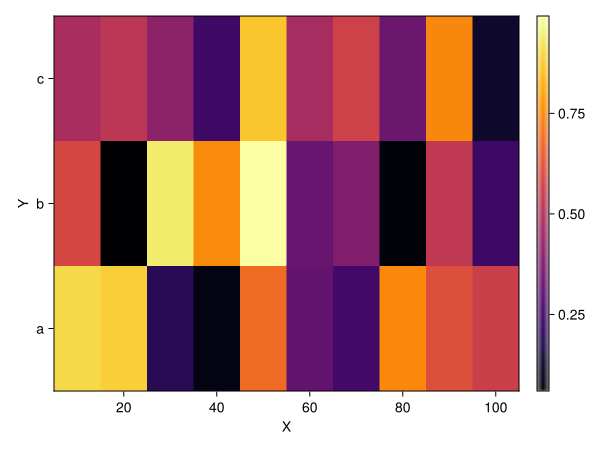
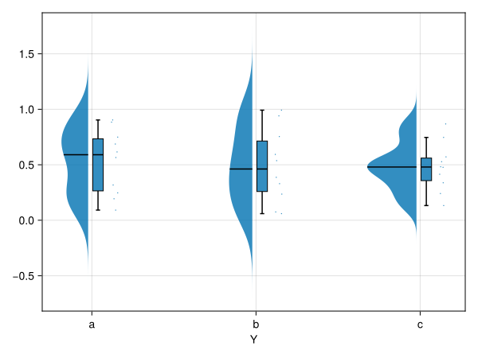
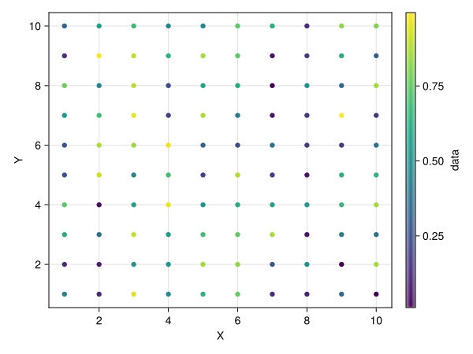
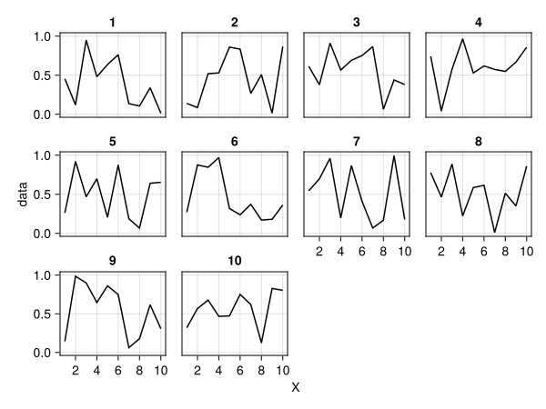
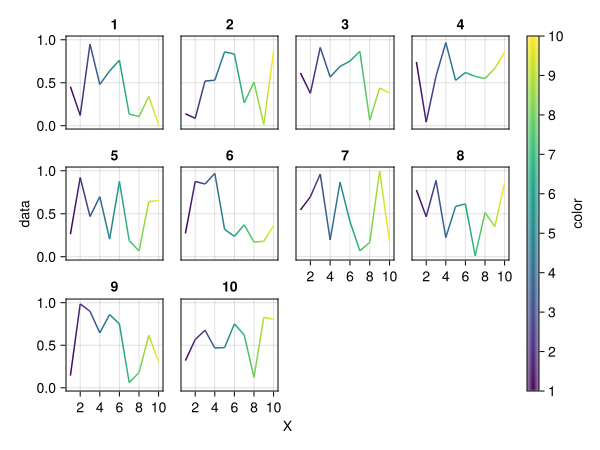
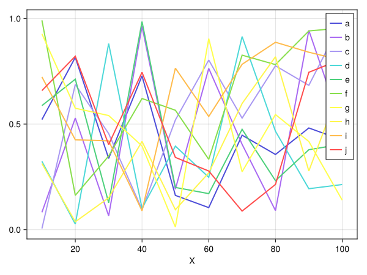
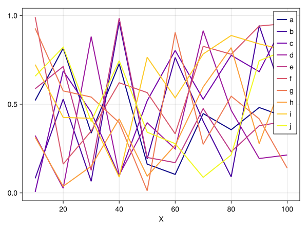
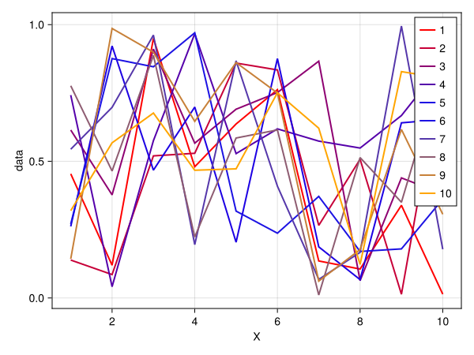
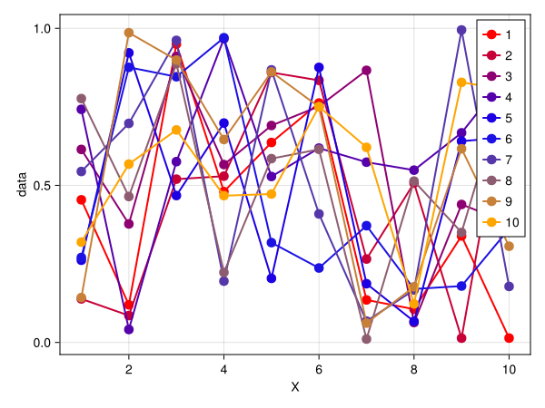

# Plots.jl {#Plots.jl}

Plots.jl and Makie.jl functions mostly work out of the box on `AbstractDimArray`, although not with the same results - they choose to follow each packages default behaviour as much as possible. 

This will plot a line plot with &#39;a&#39;, &#39;b&#39; and &#39;c&#39; in the legend, and values 1-10 on the labelled X axis:

Plots.jl support is deprecated, as development is moving to Makie.jl

# Makie.jl {#Makie.jl}

Makie.jl functions also mostly work with [`AbstractDimArray`](/api/reference#DimensionalData.AbstractDimArray) and will `permute` and  [`reorder`](/object_modification#reorder) axes into the right places, especially if `X`/`Y`/`Z`/`Ti` dimensions are used.

In Makie a `DimMatrix` will plot as a heatmap by default, but it will have labels  and axes in the right places:

```julia
using DimensionalData, CairoMakie

A = rand(X(10:10:100), Y([:a, :b, :c]))
Makie.plot(A; colormap=:inferno)
```



Other plots also work, here DD ignores the axis order and instead  favours the categorical variable for the X axis:

```julia
Makie.rainclouds(A)
```



## AlgebraOfGraphics.jl {#AlgebraOfGraphics.jl}

AlgebraOfGraphics.jl is a high-level plotting library built on top of Makie.jl that provides a declarative algebra for creating complex visualizations, similar to `ggplot2`&#39;s &quot;grammar of graphics&quot; in R. It allows you to construct plots using algebraic operations like `*` and `+`, making it easy to create sophisticated graphics with minimal code.

Any `DimensionalArray` is also a `Tables.jl` table, so it can be used with `AlgebraOfGraphics.jl` directly.  You can indicate columns in `mapping` with Symbols directly (like `:X` or `:Y`), **or** you can use the `Dim` type directly (like `X` or `Y`)! 

::: tip Note

If your dimensional array is not named, then you can access the data as the **`:unnamed`** column. Otherwise, the data is accessible by its name.

:::

Let&#39;s start with a simple example, and plot a 2-D dimarray as a scatter plot, colored by its value.

```julia
using DimensionalData, AlgebraOfGraphics, CairoMakie

A = DimArray(rand(10, 10), (X(1:10), Y(1:10)), name = :data)

data(A) * mapping(X, Y; color = :data) * visual(Scatter) |> draw
```



Don&#39;t restrict yourself to standard visualizations!  You can use all of AlgebraOfGraphics&#39; features.

Let&#39;s plot each X-slice, faceted in Y:

```julia
data(A) * mapping(X, :data; layout = Y => nonnumeric) * visual(Lines) |> draw
```



This approach is also applicable to `DimStack`s, since they also convert to DimTables.  Let&#39;s see an example here.

We&#39;ll construct a DimStack with the `:data` layer being our DimArray `A`, and an X-only variable `:color` that we&#39;ll use to color the line.

```julia
color_vec = DimVector(1:10, X)
ds = DimStack((; data = A, color = color_vec))

data(ds) * mapping(X, :data; color = :color, layout = Y => nonnumeric) * visual(Lines) |> draw
```



::: tip Note

If you wish to subset your DimArray, you can&#39;t pass selectors like `X(1 .. 2)` to AlgebraOfGraphics.   Instead, subset the DimArray you pass to `data` - this is a very cheap operation.

:::

## Test series plots {#Test-series-plots}

### default colormap {#default-colormap}

```julia
B = rand(X(10:10:100), Y([:a, :b, :c, :d, :e, :f, :g, :h, :i, :j]))
Makie.series(B)
```



### A different colormap {#A-different-colormap}

The colormap is controlled by the `color` argument, which can take as an input a named colormap, i.e. `:plasma` or a list of colours. 

```julia
Makie.series(B; color=:plasma)
```



```julia
Makie.series(A; color=[:red, :blue, :orange])
```



### with markers {#with-markers}

```julia
Makie.series(A; color=[:red, :blue, :orange], markersize=15)
```



A lot more is planned for Makie.jl plots in future!
